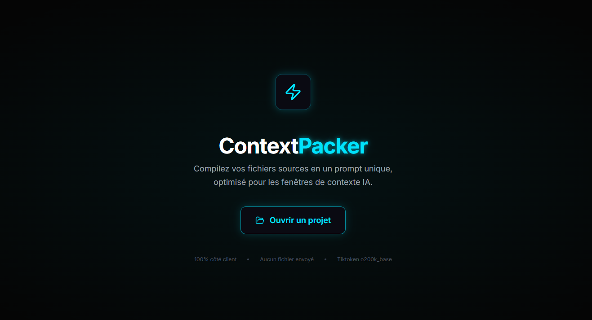

# ContextPacker v2.0

> Compilez vos fichiers sources en un prompt unique, optimisé pour les fenêtres de contexte IA.



---
## Testez !

[**Live Demo**](https://qurnt1.github.io/ContextPacker/) (API File System Access requise, utilisez un navigateur Chromium)

## ✨ Fonctionnalités

### 🔗 Stitcher intelligent
Scannez n'importe quel dossier local et assemblez les fichiers sélectionnés en un seul bloc de texte structuré, prêt à être collé dans ChatGPT, Claude, Gemini ou tout autre LLM.

### 🎯 Tiktoken o200k_base
Comptage précis des tokens via **js-tiktoken** avec l'encodeur `o200k_base` (GPT-4o). Le dashboard affiche en temps réel les tokens totaux, la taille et le nombre de lignes.

### ⚡ Minification
Réduisez la taille de vos prompts en activant la minification : suppression des commentaires, espaces superflus et lignes vides. Support JS/TS, CSS, HTML, JSON, Python, et plus.

### 📂 Intégration .gitignore
Activez le filtre `.gitignore` pour exclure automatiquement les fichiers et dossiers ignorés par Git (`node_modules`, `dist`, `.env`, etc.).

### 🎨 Thème adaptatif
Trois modes d'affichage : **Système** (suit les préférences OS), **Sombre** et **Clair**. Le thème est persisté en `localStorage`.

### ⚙️ Panneau de paramètres
- **Limite de tokens** : 32K, 64K, 128K, 200K, 500K, 1M
- **Seuil d'alerte** : popup de confirmation quand la sélection dépasse un pourcentage configurable de la limite
- **Seuil personnalisé** : valeur absolue en tokens
- Tous les réglages sont sauvegardés automatiquement.

### 🚀 Lazy Selection
Aucune fichier n'est sélectionné à l'ouverture d'un projet. Sélectionnez uniquement ce dont vous avez besoin via les extensions ou l'arborescence.

### 📋 Export
- **Copier** le résultat dans le presse-papier
- **Télécharger** un fichier `.txt` prêt à l'emploi

---

## 📐 Format de sortie

```
══════════════════════════════════════════════════════════
[CONTEXTPACKER - PROJET: mon-projet] | TOKENS: 12 450 | MINIFICATION: NON
══════════════════════════════════════════════════════════

──────────────────────────────────────────────────────────
[FILE: src/index.js] | [LINES: 42] | [TOKENS: 310]
──────────────────────────────────────────────────────────
... contenu du fichier ...
```

---

## 🛠️ Stack technique

| Technologie | Rôle |
|---|---|
| **React 18** | UI composants |
| **Vite** | Build & dev server |
| **Tailwind CSS 3.4** | Styling utilitaire + CSS variables |
| **Framer Motion** | Animations & transitions |
| **js-tiktoken** | Tokenisation (o200k_base) |
| **prism-react-renderer** | Coloration syntaxique |
| **Lucide React** | Icônes |
| **ignore** | Parsing `.gitignore` |

---

## 🚀 Installation

```bash
# Cloner le dépôt
git clone https://github.com/qurnt1/ContextPacker.git
cd ContextPacker

# Installer les dépendances
npm install

# Lancer en développement
npm run dev

# Build de production
npm run build
```

> **Pré-requis** : Node.js ≥ 18, navigateur Chromium (Chrome, Edge, Brave…) pour l'API File System Access.

---

## 🔒 Confidentialité

**100 % côté client.** Aucun fichier n'est envoyé à un serveur. Tout le traitement (scan, tokenisation, minification) s'exécute localement dans votre navigateur.

---

## 📝 Licence

MIT © 2025

---

<p align="center">
  <strong>ContextPacker v2.0</strong> — Prompt engineering, simplified.
</p>
