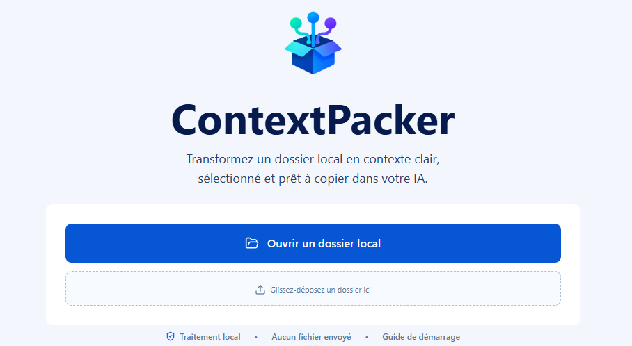

# ContextPacker

Transformez un dossier local ou un dépôt GitHub en contexte structuré pour votre IA. Le traitement se fait dans le navigateur.



## Démo

[Live Demo](https://qurnt1.github.io/ContextPacker/)

Pour l’import local, utilisez Chrome, Edge, Brave ou un autre navigateur Chromium compatible avec la File System Access API.

## Fonctionnalités

- Scan local par glisser-déposer ou sélection de dossier.
- Scan GitHub public par dépôt, branche et sous-dossier.
- Sélection par fichier, dossier, extension, `Ctrl+A` et `Shift+Clic`.
- Recherche qui ouvre automatiquement les dossiers contenant les résultats.
- Export TXT, Markdown, presse-papier et ouverture vers ChatGPT, Claude, Gemini ou Perplexity.
- Option persistante « Inclure toute l’arborescence à l’export » : la structure complète peut être exportée, mais le contenu reste limité aux fichiers sélectionnés.
- Support des fichiers JavaScript, TypeScript, JSON, JSONC, CSV, TSV et autres formats texte.
- Comptage indicatif des tokens avec `js-tiktoken` (`o200k_base`, puis `cl100k_base`).
- Historique local/GitHub, favoris et réouverture d’un dossier local via IndexedDB.

## Sécurité et fichiers sensibles

Les fichiers secrets sont affichés pour rendre leur présence explicite, mais restent bloqués et ne sont jamais lus ni exportés. Cela inclut notamment `.env`, `.env.local`, les certificats et clés privées, `.npmrc`, `.pypirc`, `credentials*.json`, `service-account*.json`, ainsi que `.venv` et `venv`.

Les modèles `.env.example`, `.env.sample`, `.env.template` et `.env.defaults` restent sélectionnables. Les fichiers trop volumineux sont visibles mais non sélectionnables.

Le token GitHub est utilisé uniquement en mémoire pour la session. Il n’est pas sauvegardé dans `localStorage` ni dans les réglages persistés. Les données de dépôt sont demandées directement à GitHub depuis le navigateur, sans serveur applicatif ContextPacker.

## Source et export

Le contrôle « Formatage compact » est conservé pour compatibilité, mais la transformation est volontairement désactivée : le contenu source exporté reste inchangé. Le comptage affiché dans le tableau de bord correspond aux tokens du contenu sélectionné. L’export recalcule séparément son estimation finale, qui inclut sa structure et ses métadonnées.

Les exports utilisent un snapshot GitHub immuable lorsque le dépôt est distant. Les caches sont bornés et séparés entre session authentifiée et anonyme. Les réponses GitHub tronquées, les erreurs API et les limites de taille sont signalées au lieu d’être masquées.

## Installation

```bash
git clone https://github.com/qurnt1/ContextPacker.git
cd ContextPacker
npm install
npm run dev
```

Build production :

```bash
npm run build
```

Tests :

```bash
npm test
```

## Paramètres

- Limite de tokens cible, de 32k à 1M.
- Pourcentage d’alerte et seuil manuel.
- Token GitHub facultatif, uniquement en mémoire.
- Activation de `.gitignore`.
- Option d’arborescence complète à l’export.

## Raccourcis clavier

| Raccourci | Action |
|---|---|
| `Ctrl+A` | Tout sélectionner |
| `Ctrl+Shift+A` | Tout désélectionner |
| `Ctrl+F` | Rechercher un fichier |
| `Shift+Clic` | Sélectionner une plage de fichiers |
| `?` | Afficher l’aide |

## Confidentialité

ContextPacker est une application client-side. Les fichiers sont lus et traités localement dans le navigateur. Les seuls appels externes attendus sont les appels GitHub nécessaires au scan distant et les ouvertures explicites vers les services LLM. L’interface charge également sa police via Google Fonts.

## Licence

Aucun fichier `LICENSE` n’est actuellement inclus dans ce dépôt. L’absence de licence explicite doit être résolue avant de présenter le projet comme MIT.
